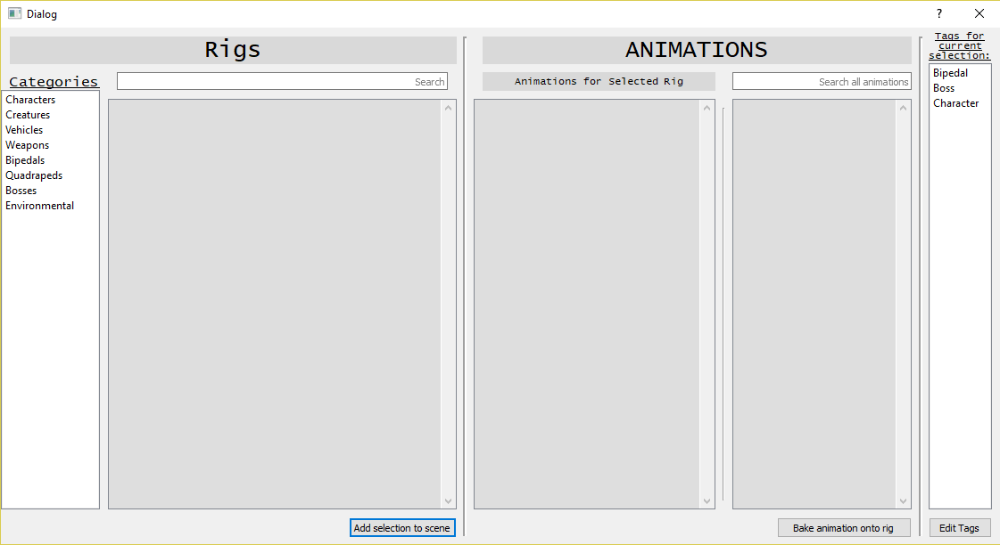

# A pythonic rigs and animation manager written for Autodesk Maya 2018.

A tool for managing rig and animation assets, and baking animations back onto rigs.

## Prerequisites:

* PyQt5
* Autodesk Maya 2018

## Built with:

* PyQt5
* Maya.cmds
* Maya.mel

## Main UI window wireframe:

    A UI wireframe I created in QtDesigner

## How to use:

* After Launching the manager the user should be able to either add a rig to the..
    ..rig library or select a rig from the library
* This will populate the animations scroll field with any animations that rig has..     ..associated with it. the user can also add any animations made to the..            ..library for that rig
    
* Add the rig into the scene.
*  *A* Bake the desired animation onto the rig..
   ..*B* Attempt to bake any searched animations to the rig. Which will attempt.. ..to bake the animation for any matching joints